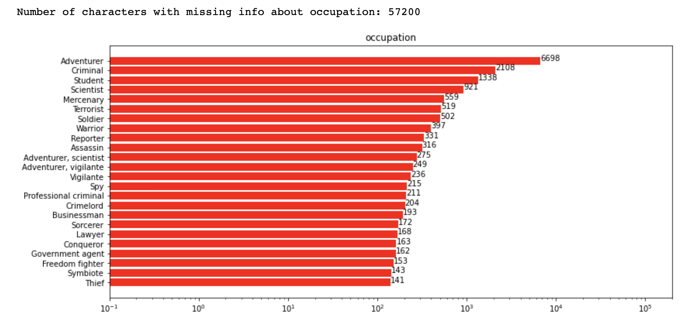
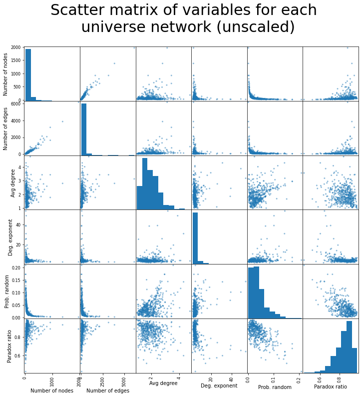

# Welcome to GitHub Pages for our Marvel Universe Project

# Motivation

The dataset chosen for this assignment is the full Marvel dataset from [marvel.fandom.com](https://marvel.fandom.com/wiki/Marvel_Database), also called as the Marvel Database. 

The dataset of the Marvel characters was chosen as it provides a lot of information about all the multiverses/universes in Marvel and also because there are many attributes available describing all 36.414 unique characters. There are 36.414 unique characters, but the entire dataset contains 73.574 characters, as many characters appear in more than one universe and they have separate pages for such parallel characters. 

The data is gathered using [API](https://en.wikipedia.org/wiki/API). Through that we got the text information that is partially human-readable and contains links to other pages. We also know which character (in which universe) the text corresponds to. Character names are stored as they are on Marvel wikipedia.

Starting this assignment the assumption was that each universe had an extensive character-list of all characters in there. By investigation of the dataset this has led to some wondering of what it means with these universes and why there is such big difference between the number of characters in the universes. 

Each character is described by attributes and text. The attributes will be extracted from the description of each character to gain knowledge on the characters and to be able to see how they can differ. The attributes chosen that will be analysed further in this assignment are: gender, occupation, citizenship, identity and hair. 

A sentiment analysis will be carried out on wiki texts in order to find the characters with the most negative and positive influence. It can be argued that wiki text shouldn't have much sentiment but then again a lot of different authors have wrote it and descriptive text about extravagant characters probably still has some sentiment in it, no matter how neutral it has been tried to made.

A machine learning approach to predict how often the [friendship paradox](https://en.wikipedia.org/wiki/Friendship_paradox) rings true for a network was investigated. The goal of using machine learning is to present to the reader what variables are influential in deciding the success rate of the friendship paradox.

We will now try to take you through our approaches and results. It has taken quite a lot of work and for more insights check out our `Explainer notebook.ipynb` in our [GitHub repository](https://github.com/kito323/MarvelUniverses). Now, hang on tight and let's get into it!

# Basic statistics

The first overview gives us that the dataset consists of 73574 texts from API requests. Those texts include character attributes, that can be filled to help describe each character, and paragraph sections, that can be used to look for connected characters and sentiment analysis.

There is an example of such text below:


# Toosl, theory and analysis

### Creating entire network of all characters

### Degree distribution of the entire network

The degree distribution will now be investigated. The most connected characters in terms of both in- and out-degrees are:

| Index 	|                     Title 	| In-degree 	|
|------:	|--------------------------:	|-----------	|
|     0 	|  Peter Parker (Earth-616) 	|      1906 	|
|     1 	| Steven Rogers (Earth-616) 	|      1689 	|
|     2 	| Anthony Stark (Earth-616) 	|      1368 	|
|     3 	| James Howlett (Earth-616) 	|      1233 	|
|     4 	|  Bruce Banner (Earth-616) 	|      1102 	|

|   	|                     Title 	| Out-degree 	|
|--:	|--------------------------:	|------------	|
| 0 	| Krakoa (Earth-616)        	| 345        	|
| 1 	| Bruce Banner (Earth-616)  	| 281        	|
| 2 	| James Howlett (Earth-616) 	| 276        	|
| 3 	| Peter Parker (Earth-616)  	| 248        	|
| 4 	| William Baker (Earth-616) 	| 221        	|

From the top-connected characters we see how (Earth-616) is referenced frequently. This chapter/universe is stated to be the main universe according to marvel.fandom.wiki [Ref 4]. Therefore the characters in this universe are frequently referenced from other universes which is why the in-degree is so much higher compared to the out degree. In both in- and out-degrees it is seen that Bruce Banner (Hulk), Peter Parker (Spiderman), Steven Rogers (Captain America), Anthony Stark (Ironman) and James Howlett (Wolverine) who are all central characters in the Marvel univers as to why this makes sense.


The degree distribution shows how the majority of the nodes/characters have a relatively low both in- and out-degree where the vast majority have a degree below 10 for both. There are many, many side characters in the Marvel universe, and it makes sense that most of them are only referenced no, one, or two times, and that's why the in-degree count for degrees 0-3 is so high. The out-degree, however, is not affected by this; a page can link to as many other characters as the article allows. Therefore, it makes sense that the out-degrees are more evenly distirbuted, with a higher degree being more common than for the in-degree distribution.


Both networks appear to follow a $p_k\sim k^{-\gamma}$ distribution (equation (4.1) in the [Network Science Book](http://networksciencebook.com/)), where $k$ is the degree, and $\gamma$ is the degree exponent. We can see this from the fact that the log-log plots show roughly straight lines.

The in-degree and out-degree exponents calculated above are the slopes of the log-log plot of the distributions, which can be seen in the above plots.

Referring to Box 4.5 in the textbook, we can see that the in-degree distribution falls in the "scale-free" regime, while the out-degree distribution also falls in the scale-free network regime, although it is a little closer to 3 than the in-degree distribution.

Comparing this with the four-way distribution plot with zoomed-in versions for the in- and out-degrees for the all-characters network, we can see that the out-degree distribution resembles more a random network than does the in-degree distribution.

### Character attribute analysis




### Character and universe analysis

We will now analyze the characters of the universes and the universes as well.

Firstly we will take a look at the number of universes in the dataset (found as they are listed in the names of the characters).

Then we will take a look at how many unique characters are contained in the dataset.

The 30 characters appearing in most universes are then printed alongside the number of universes they appear in:


It is seen how Peter Parker appear in 605 universes and is the character appearing in most. Peter Parker is Spiderman's civil name and characters, which is why it makes sense. Anthony Stark, Steven Rogers and James Howlett are Iron Man, Captain America and Wolverine respectively and these are also main characters of the universe as to why it makes a lot of sense that these are reference in a high number of universes.

**Directed network of characters present in more than one universe**


The degree distribution of the network across universes of characters appearing in more than 1 universe, shows how most characters have both in- and out-degrees below 100. Then there are some having in- and out-degrees between 100-300 and a few (Spiderman, Iron Man, Captain America and Wolverine) having a very high in- and/or out-degree. Again the reason that these specific characters have high degrees are because of their central role in the marvel universes.

### Interactive network plot (characters present in more than 5 universes and in Earth-616)

Firstly an interactive plot is made to be able to inspect the names and attributes of the node hovered over. Then a plot is made to be able to inspect the the connected components of the character hovered over. A third interactive plot is then made bringing the interactive parts of the first two together. In the resulting plot it is therefore possible to inspect both the character by name, attributes and connections by hovering over him/her.




**Earth 210**

The thought was to choose some different universes and compare these to the main universe Earth-616. But as this analysis of other universes started we saw how Earth 210 contains only 5 characters, as to why this universe analysis is not carried out. This indicates some big differences in universes, som universes contain a lot of characters and even some also present in other universes, while others seem to only contain very few. That a character is contained in the data for a universe means that this characters is either a resident or has been to the planet. The following cells show the network from Earth 210.


|   	|                     Title 	| In-degree 	|
|--:	|--------------------------:	|-----------	|
| 0 	| Anthony Stark (Earth-210) 	|         4 	|
| 1 	|        Thanos (Earth-210) 	|         4 	|
| 2 	|  Peter Parker (Earth-210) 	|         3 	|
| 3 	|   Peter Quill (Earth-210) 	|         3 	|
| 4 	|         Death (Earth-210) 	|         1 	|

It seems by further investigation that the characters contained in the universes, are the characters that have been to the particular Earth-XX! Earth-616 is then the planet/universe most characters have been to, while only five characters have been to Earth-210. This leads to investigating the number of characters that have been to each universe.

**Characters in each universe**

We see how there are very few characters in Earth 210, which leads to the interest of making a character distribution graph.


### Network theory comparison

**Average shortest path**

Average degree for the entire network is: 7.39
Average degree for the network of characters appearing in more than 5 universes is: 89.23
Average degree for the entire Earth-616 is: 8.60
Average degree for the network of Earth-616 characters appearing in more than 5 universes is: 44.17

Average shortest path for the entire network is: 5.60
Average shortest path for the network of characters appearing in more than 5 universes is: 1.55
Average shortest path for the entire Earth-616 is: 4.79
Average shortest path for the network of Earth-616 characters appearing in more than 5 universes is: 1.77

The average degree tells us about how well connected the nodes in the networks are. The average degree for the entire network and the entire network of Earth-616 characters have a somewhat high average degree meaning that the nodes are well connected. 

The network containing the characters present in more than 5 universes has a very high average degree of 89.23. This makes sense as the characters have had their universe information removed from their names, and all the descriptions of each character regardless of universes are summed up.

The connected components for each character is then found in the summed descriptions and therefor it is the connected characters for all universes they appear in and the average degree will therefore be higher, which it also is. The average degree of the network created from Earth-616 is very high when it is taken into account that the connected characters here are found in the descriptions for only Earth-616. The network of characters in this universe must be said to be very connected.

**Regimes**

The average degree of the networks can be used to analyse which regime they are in. In the printings above it is analysed whether the networks are in the connected regime. All the average degrees are above 1, which means that if the statements are False, they are in the supercritical regime, and if the statements are true, the networks are in the connected regime. The entire network and the network of the entire Earth-616 universe are both in the supercritical regime, while the two networks containing central characters (central characters as they are present in more than 5 universes) are in the connected regime.

Being in the connected regime means that all the nodes have been consumed by the Giant Connected Component [Ref 1], which is the case for the two networks of the central characters.

### Friendship paradox for Marvel characters

What is the friendship paradox? It's surprising that the amount of times that a node's degree is less than the average happens more often than you'd think. The reason is that, sometimes, hubs of nodes will form which have a higher average degree than the rest of the network. This way, there can actually be a substantial part of the network which have lower degrees than the network's average.

We thought this was an interesting property of networks because it partly reveals how the network is structured. If the friendship paradox is true often, then the network probably has the aforementioned hubs with a high average degree. The exciting thing about this is that we can ascertain this important property of the network with a small sample from the network -- often, 100 tries is enough! So if we had a network that was so large that it couldn't even be processed by a single computer, but we still had a way of sampling from it, then we could know a lot just from sampling and trying out the friendship paradox.

We tried out a bunch of different variables to try to predict how often the friendship paradox rings true for a network. 

What ended up working was, firsly, the average degree, which isn't surprising since it's an integral part of the friendship paradox. However, what was surprising was that the probability for a random network, with the same number of nodes and average degree as the network, turned out to be the strongest predictor, and the power-law probability wasn't useful at all!

We used nested cross-validation. It's a neat way to avoid the common problem of adjusting your model according to testing results. 




The results of our first try without nested cross-validation. In this one, we tweaked the parameters until we found a model that did the best on the test set -- a bad practice!

So, nested cross-validation to the rescue!


### Sentiment analysis

In this section we want to investigate more the texts of the wikipages - more percisely the sentiment of their pages. For that we used the **dictionary based method** meaning we have a dataset where regular words have some sentiment score assigned to them and then we look up all such words in the text and find the arithmetic mean of those word scores. The dataset, named LabMT, we used for dictionary originates from [Temporal Patterns of Happiness and Information in a Global Social Network: Hedonometrics and Twitter](https://journals.plos.org/plosone/article?id=10.1371/journal.pone.0026752#s4) study.

Dictionary based method comes with several **problems like misunderstood negation, superlative and irony**. But with a big enough text it shouldn't be that problematic because nobody usually talks with negations or using irony only. Also it is important that text has to be transformed into lowercase, lemmatized and tokenized - every word's stem is separated and with no capital letters.

But enough about the problems with methods, let's see what problems do we have with our text data. Firstly, the problem with wikipedias is that several people write them and that means that there is a lot of inconsistency. So not all paragraphs and attributes are included in each API request we made. It seems so that **Trivia** and **History** are probably the best paragraphs to look into as they have a lot of original text (meaning there will hopefully be more sentiment and less copy-paste text) and they were present quite often. Other paragraphs might often have just a common sentence across the characters.

Second problem was that the the text from API request was not completely human-readable shape, so some **cleaning** was needed to be done.

And thirdly, as there are many universes often sharing basically same characters, then the text is often same as well or just redirecting to some counterpart in another universe. For that reason we only decided to investigate **Earth-616** universe because it is considered being the main universe and mostly the other universes reference this one, instead *vice versa*.

After all that, we found the sentiment scores separately for History and Trivia paragraphs. Results were graphed as histograms as shown below.


As it can be seen, this was done using two different bin-counts in histograms. This way we could spot different things using different levels of detail. And also as there was a lot less Trivia paragraps present compared to History ones then the chosen bin-count was also selected differently for them (bin-count values shown on graphs).

Both chapters show **nice Gaussian** like distribution overall (in lower resulution), with Trivia distribution peak shifted a little bit towards the higher end - "fun facts" are actually fun and a well-written character has miserable history.

But when looking the distributions using higher bin-count it can be seen that something weird is going on. The really high peak around 5.6 sentiment score on History graph is due to a large number (135) of similar side characters, [fallen Angels](https://marvel.fandom.com/wiki/Angels_(Monotheism)#Aftermaths), that share the same text besides names and therefore have the exact same sentiment score. As they were angles and it isn't much text about them on their separate wikipages, their score is heavily diviated from the central value of the distribution, making the abnormality especially eye-catching.

Although, similar lower peaks could be noticed on the Trivia graph too, we only found that maximum number of exactly same sentiment scores was only 6, which when looking high-detail Trivia graph isn't that much.

What was similar for all those occurence cases was that:
1. those texts are about some side-characters - there is not much to talk about them and
2. the texts are about some clone or model characters that originate all from one same character - they share similar story/fun facts.

We also looked the minimum/maximum/median/mean score texts too. What was by now expected is that the extremes have a little amount of text - few good/bad words and the character's average sentiment is heavily influenced. The lowest sentiment sentences included words like **"killed", "defeated" and "hates"**, whereas highest score sentences included words like **"likes", "flowers", "loved", "super-heroes"**.

The texts that were closest to median and mean values were a bit different - they had more length. Interestingly, they seemed to have rather negative sentiment in reality. They talk a lot about **alcoholism, murder, grudge, pistol, wound and death** and a bit about positive things like **"family", "success", "good friendship" and how "hero" saves the day**. But then again sometimes those good words are used in negative context like "family murder scene" and "lack of success". This is something that the dictionary based method cannot detect unfortunately.

For more information about those texts and the characters who they belong to can be found on our explainer notebook.

Lastly, we put together the History and Trivia texts, calculated the overall average sentiment score for each character and ploted the distribution as line graph shown below. In adition to that we also looked which characters had the longest resulting texts and determined their popularity rank using that. Then ploted top most characters there as well with names, to see who has what score and hopefully would recognise a few of them.



The graph is interactive - meaning that it can be panned and zoomed and when hovering cursor above datapoints it shows relevant information about them (name of character, popularity of character (alias: length of their text) and a short part from the beginning of their History and Trivia paragraphs). It is important to mention that the distribution curve (red line) is zoomed in on x axis and the whole distribution can be seen when clicked on the 'Autoscale' button on upper right corner - apparently all the characters that have lengthy text about them have fairly central sentiment score.

With that aside, we noticed that several evil characters are on the left side of our sentiment scale meaning they have more negative sentiment (examples of popular evil characters: **Frank Castle a.k.a The Punisher, Venom (Symbiote), Edward Brock a.k.a Eddy, Wolfgang von Strucker (Hydra Leader), Victor Creed a.k.a Sabertooth**). And on the other end we find rather passionate characters who are more related to romance or good side (popular examples from that side consist: **Hope Summers (X-men), Mary Jane Watson a.k.a MJ, Robert Drake a.k.a Iceman (X-men), Jean Grey (often related to Pheonix, X-men), Clinton Barton a.k.a Hawkeye**).

What is particularly interesting is that we can find **Nicholas Fury** on the the left side (negative) of our sentiment scale. Nick Fury is known for being the leader of S.H.I.E.L.D agency, that is usually **sided with heros**. We will let readers wonder why is it so. But in case nothing comes to your mind then check out our [explainer notebook](https://github.com/kito323/MarvelUniverses), where we state our idea of this result.


## Dataset download

## Explainer notebook


You can use the [editor on GitHub](https://github.com/kito323/MarvelUniverses/edit/gh-pages/index.md) to maintain and preview the content for your website in Markdown files.

Whenever you commit to this repository, GitHub Pages will run [Jekyll](https://jekyllrb.com/) to rebuild the pages in your site, from the content in your Markdown files.

Here is interactive iris dataset visualised


And here is interactive NetworkX graph



TEST


And this is how i feel after this


Interactive Deepnote cell

```<iframe title="Embedded cell output" src="https://embed.deepnote.com/972a3b21-ed0b-49ad-94ce-ad59397a5d4f/b12d7987-1634-4196-926d-80b7c2d0b3c6/00011-92273088-0012-4d1d-9dc5-98629df1b38d?height=83" height="400" width="600"/>
```

### Markdown

Markdown is a lightweight and easy-to-use syntax for styling your writing. It includes conventions for

```markdown
Syntax highlighted code block

# Header 1
## Header 2
### Header 3

- Bulleted
- List

1. Numbered
2. List

**Bold** and _Italic_ and `Code` text

[Link](url) and 
```

For more details see [Basic writing and formatting syntax](https://docs.github.com/en/github/writing-on-github/getting-started-with-writing-and-formatting-on-github/basic-writing-and-formatting-syntax).

### Jekyll Themes

Your Pages site will use the layout and styles from the Jekyll theme you have selected in your [repository settings](https://github.com/kito323/MarvelUniverses/settings/pages). The name of this theme is saved in the Jekyll `_config.yml` configuration file.

### Support or Contact

Having trouble with Pages? Check out our [documentation](https://docs.github.com/categories/github-pages-basics/) or [contact support](https://support.github.com/contact) and we’ll help you sort it out.
