# Welcome to GitHub Pages for our Marvel Universe Project

## Motivation

The dataset chosen for this assignment is the full Marvel dataset from [marvel.fandom.com](https://marvel.fandom.com/wiki/Marvel_Database), also called as the Marvel Database. 

The dataset of the Marvel characters was chosen as it provides a lot of information about all the multiverses/universes in Marvel and also because there are many attributes available describing all 36 414 unique characters. There are 36 414 unique characters, but the entire dataset contains 73 574 characters, as many characters appear in more than one universe and they have separate pages for such parallel characters. 

The data is gathered using [API](https://en.wikipedia.org/wiki/API). Through that we got the text information that is partially human-readable and contains links to other pages. We also know which character (in which universe) the text corresponds to. Character names are stored as they are on Marvel wikipedia.

Starting this assignment the assumption was that each universe had an extensive character-list of all characters in there. By investigation of the dataset this has led to some wondering of what it means with these universes and why there is such big difference between the number of characters in the universes. 

Each character is described by attributes and text. The attributes will be extracted from the description of each character to gain knowledge on the characters and to be able to see how they can differ. The attributes chosen that will be analysed further in this assignment are: gender, occupation, citizenship, identity and hair. 

A sentiment analysis will be carried out on wiki texts in order to find the characters with the most negative and positive influence. It can be argued that wiki text shouldn't have much sentiment but then again a lot of different authors have wrote it and descriptive text about extravagant characters probably still has some sentiment in it, no matter how neutral it has been tried to made.

A machine learning approach to predict how often the [friendship paradox](https://en.wikipedia.org/wiki/Friendship_paradox) rings true for a network was investigated. The goal of using machine learning is to present to the reader what variables are influential in deciding the success rate of the friendship paradox.

We will now try to take you through our approaches and results. It has taken quite a lot of work and for more insights check out our `explainer notebook` in our [GitHub repository](https://github.com/kito323/MarvelUniverses). Now, hang on tight and let's get into it!

## Basic statistics

The first overview gives us that the dataset consists of 73574 texts from API requests. Those texts include character attributes, that can be filled to help describe each character, and paragraph sections, that can be used to look for connected characters and sentiment analysis.

There is an example of such text below:

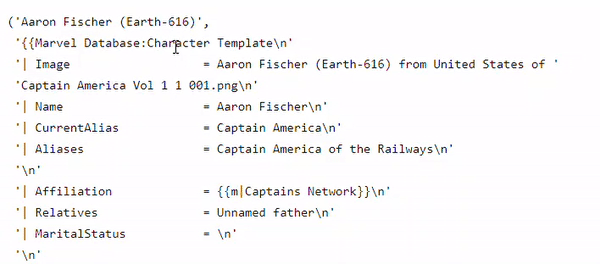

## Analysis

### Creating entire network of all characters

### Degree distribution of the entire network

### Character attribute analysis

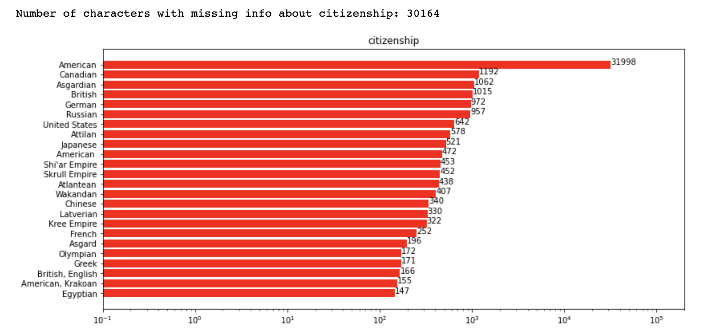
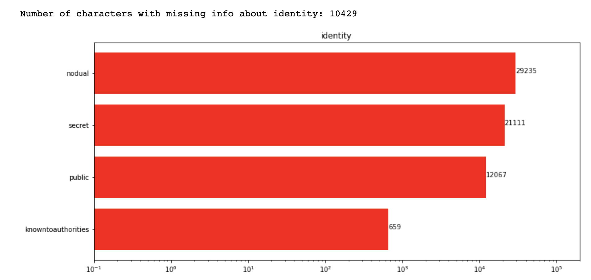
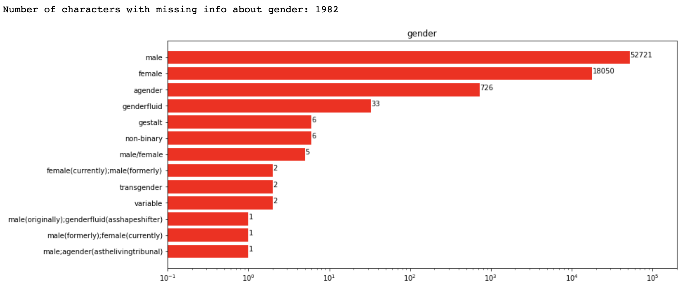
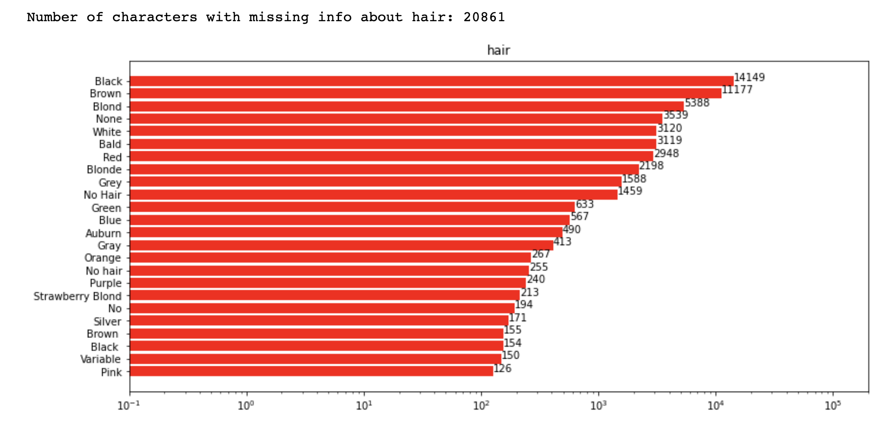
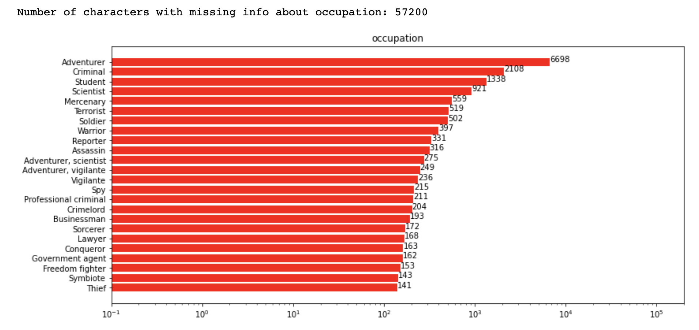


### Network theory comparison

### Friendship paradox for Marvel characters

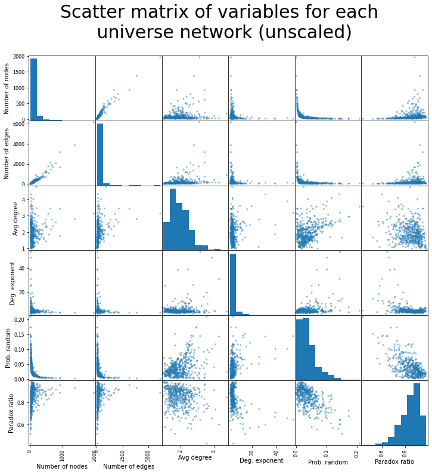

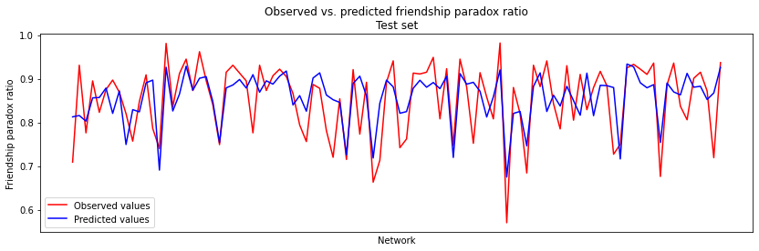
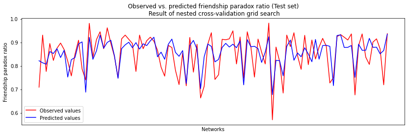


### Sentiment analysis

In this section we want to investigate more the texts of the wikipages - more percisely the sentiment of their pages. For that we used the **dictionary based method** meaning we have a dataset where regular words have some sentiment score assigned to them and then we look up all such words in the text and find the arithmetic mean of those word scores. The dataset, named LabMT, we used for dictionary originates from [Temporal Patterns of Happiness and Information in a Global Social Network: Hedonometrics and Twitter](https://journals.plos.org/plosone/article?id=10.1371/journal.pone.0026752#s4) study.

Dictionary based method comes with several **problems like misunderstood negation, superlative and irony**. But with a big enough text it shouldn't be that problematic because nobody usually talks with negations or using irony only. Also it is important that text has to be transformed into lowercase, lemmatized and tokenized - every word's stem is separated and with no capital letters.

But enough about the problems with methods, let's see what problems do we have with our text data. Firstly, the problem with wikipedias is that several people write them and that means that there is a lot of inconsistency. So not all paragraphs and attributes are included in each API request we made. It seems so that **Trivia** and **History** are probably the best paragraphs to look into as they have a lot of original text. Other paragraphs might often have just a common sentence across the characters.

Second problem was that the the text from API request was not completely human-readable shape, so some **cleaning** was needed to be done.

And thirdly, as there are many universes sharing basically same characters often then the text is often same as well or just redirecting to some counterpart in another universe. For that reason we only decided to investigate **Earth-616** universe because it is considered being the main universe and mostly the other universes reference this one, instead *vice versa*.

After all that, we found the sentiment scores separately for History and Trivia paragraphs. Results were graphed as histograms as shown below.

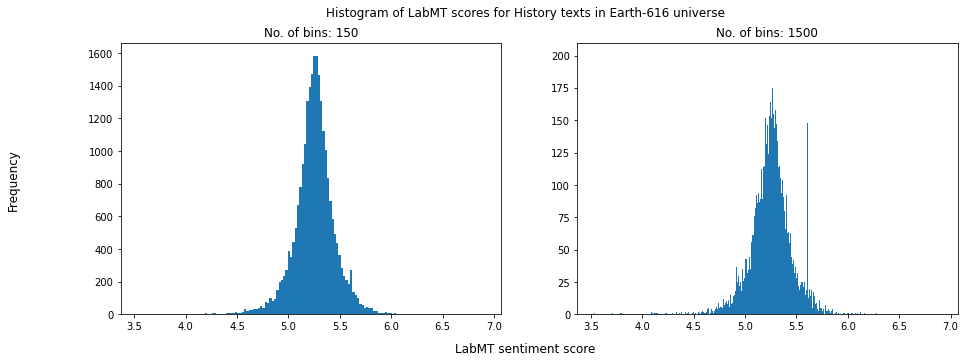
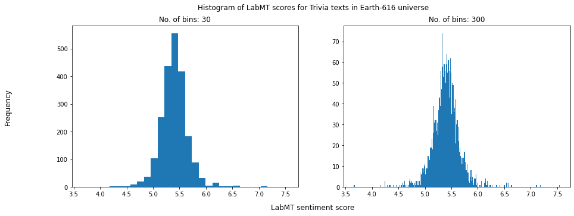

As it can be seen, this was done using two different bin-counts in histograms. This way we could spot different things using different levels of detail. And also as there was a lot less Trivia paragraps present compared to History ones then the chosen bin-count was also selected differently for them (bin-count values shown on graphs).

Both chapters show **nice Gaussian** like distribution overall (in lower resulution), with Trivia distribution peak shifted a little bit towards the higher end - "fun facts" are actually fun and a well-written character has miserable history.

But when looking the distributions using higher bin-count it can be seen that something weird is going on. The really high peak around 5.6 sentiment score on History graph is due to a large number (135) of similar side characters, [fallen Angels](https://marvel.fandom.com/wiki/Angels_(Monotheism)#Aftermaths), that share the same text besides names and therefore have the exact same sentiment score. As they were angles and it isn't much text about them on their separate wikipages, their score is heavily diviated from the central value of the distribution, making the abnormality especially eye-catching.

Although, similar lower peaks could be noticed on the Trivia graph too, we only found that maximum number of exactly same sentiment scores was only 6, which when looking high-detail Trivia graph isn't that much.

What was similar for all those occurence cases was that:
1. those texts are about some side-characters - there is not much to talk about them and
2. the texts are about some clone or model characters that originate all from one same character - they share similar story/fun facts.

We also looked the minimum/maximum/median/mean score texts too. What was by now expected is that the extremes have a little amount of text - few good/bad words and the character's average sentiment is heavily influenced. The lowest sentiment sentences included words like **"killed", "defeated" and "hates"**, whereas highest score sentences included words like **"likes", "flowers", "loved", "super-heroes"**.

The texts that were closest to median and mean values were a bit different - they had more length. Interestingly, they seemed to have rather negative sentiment in reality. They talk a lot about **alcoholism, murder, grudge, pistol, wound and death** and a bit about positive things like **"family", "success", "good friendship" and how "hero" saves the day**. But then again sometimes those good words are used in negative context like "family murder scene" and "lack of success". This is something that the dictionary based method cannot detect unfortunately.

Lastly, we put together the History and Trivia texts, calculated the overall average sentiment score for each character and ploted the distribution as line graph shown below. In adition to that we also looked which characters had the longest resulting texts and determined their popularity rank like that. Then ploted top most characters there as well with names to see who has what score and hopefully would recognise a few of them.



The graph is interactive - meaning that it can be panned and zoomed and when hovering cursor above datapoints it shows relevant information about them (name of character, popularity of character (alias: length of their text) and a short part from the beginning of their History and Trivia paragraphs). It is important to mention that the distribution curve (red line) is zoomed in on x axis and the whole distribution can be seen when clicked on the 'Autoscale' button on upper right corner - apparently all the characters that have lengthy text about them have fairly central sentiment score.

With that aside, we noticed that several evil characters are on the left side of our sentiment scale meaning they have more negative sentiment (examples of popular evil characters: **Frank Castle a.k.a The Punisher, Venom (Symbiote), Edward Brock a.k.a Eddy, Wolfgang von Strucker (Hydra Leader), Victor Creed a.k.a Sabertooth**). And on the other end we find rather passionate characters who are more related to romance or good side (popular examples from that side consist: **Hope Summers (X-men), Mary Jane Watson a.k.a MJ, Robert Drake a.k.a Iceman (X-men), Jean Grey (often related to Pheonix, X-men), Clinton Barton a.k.a Hawkeye**).

What is particularly interesting is that we can find **Nicholas Fury** on the the left side (negative) of our sentiment scale. Nick Fury is known for being the leader of S.H.I.E.L.D agency, that is usually **sided with heros**. We will let readers wonder why is it so. But in case nothing comes to your mind then check out our [explainer notebook](https://github.com/kito323/MarvelUniverses), where we state our idea of this result.


## Discussion


You can use the [editor on GitHub](https://github.com/kito323/MarvelUniverses/edit/gh-pages/index.md) to maintain and preview the content for your website in Markdown files.

Whenever you commit to this repository, GitHub Pages will run [Jekyll](https://jekyllrb.com/) to rebuild the pages in your site, from the content in your Markdown files.

Here is interactive iris dataset visualised


And here is interactive NetworkX graph



TEST


And this is how i feel after this


Interactive Deepnote cell

```<iframe title="Embedded cell output" src="https://embed.deepnote.com/972a3b21-ed0b-49ad-94ce-ad59397a5d4f/b12d7987-1634-4196-926d-80b7c2d0b3c6/00011-92273088-0012-4d1d-9dc5-98629df1b38d?height=83" height="400" width="600"/>
```

### Markdown

Markdown is a lightweight and easy-to-use syntax for styling your writing. It includes conventions for

```markdown
Syntax highlighted code block

# Header 1
## Header 2
### Header 3

- Bulleted
- List

1. Numbered
2. List

**Bold** and _Italic_ and `Code` text

[Link](url) and 
```

For more details see [Basic writing and formatting syntax](https://docs.github.com/en/github/writing-on-github/getting-started-with-writing-and-formatting-on-github/basic-writing-and-formatting-syntax).

### Jekyll Themes

Your Pages site will use the layout and styles from the Jekyll theme you have selected in your [repository settings](https://github.com/kito323/MarvelUniverses/settings/pages). The name of this theme is saved in the Jekyll `_config.yml` configuration file.

### Support or Contact

Having trouble with Pages? Check out our [documentation](https://docs.github.com/categories/github-pages-basics/) or [contact support](https://support.github.com/contact) and we’ll help you sort it out.
