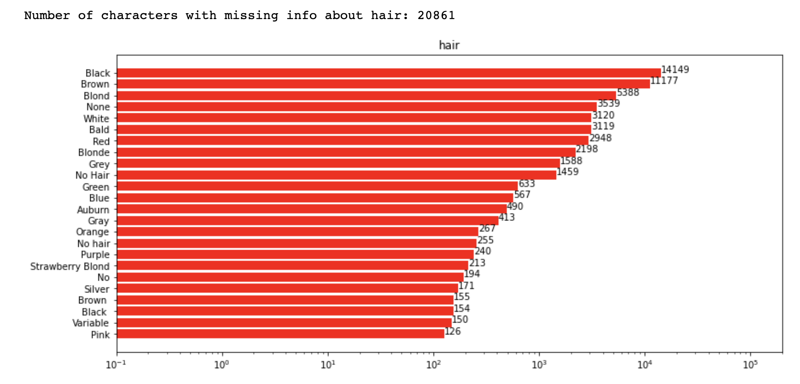

# Welcome to GitHub Pages for our Marvel Universe Project

## Motivation

## Basic statistics

## Toosl, theory and analysis

### Creating entire network of all characters

### Degree distribution of the entire network

### Character attribute analysis





### Network theory comparison

### Friendship paradox for Marvel characters

What is the friendship paradox? It's surprising that the amount of times that a node's degree is less than the average happens more often than you'd think. The reason is that, sometimes, hubs of nodes will form which have a higher average degree than the rest of the network. This way, there can actually be a substantial part of the network which have lower degrees than the network's average.

We thought this was an interesting property of networks because it partly reveals how the network is structured. If the friendship paradox is true often, then the network probably has the aforementioned hubs with a high average degree. The exciting thing about this is that we can ascertain this important property of the network with a small sample from the network -- often, 100 tries is enough! So if we had a network that was so large that it couldn't even be processed by a single computer, but we still had a way of sampling from it, then we could know a lot just from sampling and trying out the friendship paradox.

We tried out a bunch of different variables to try to predict how often the friendship paradox rings true for a network. 

What ended up working was, firsly, the average degree, which isn't surprising since it's an integral part of the friendship paradox. However, what was surprising was that the probability for a random network, with the same number of nodes and average degree as the network, turned out to be the strongest predictor, and the power-law probability wasn't useful at all!

We used nested cross-validation. It's a neat way to avoid the common problem of adjusting your model according to testing results. 


### Sentiment analysis





## Dataset download

## Explainer notebook


You can use the [editor on GitHub](https://github.com/kito323/MarvelUniverses/edit/gh-pages/index.md) to maintain and preview the content for your website in Markdown files.

Whenever you commit to this repository, GitHub Pages will run [Jekyll](https://jekyllrb.com/) to rebuild the pages in your site, from the content in your Markdown files.

Here is interactive iris dataset visualised


And here is interactive NetworkX graph



TEST


And this is how i feel after this


Interactive Deepnote cell

```<iframe title="Embedded cell output" src="https://embed.deepnote.com/972a3b21-ed0b-49ad-94ce-ad59397a5d4f/b12d7987-1634-4196-926d-80b7c2d0b3c6/00011-92273088-0012-4d1d-9dc5-98629df1b38d?height=83" height="400" width="600"/>
```

### Markdown

Markdown is a lightweight and easy-to-use syntax for styling your writing. It includes conventions for

```markdown
Syntax highlighted code block

# Header 1
## Header 2
### Header 3

- Bulleted
- List

1. Numbered
2. List

**Bold** and _Italic_ and `Code` text

[Link](url) and 
```

For more details see [Basic writing and formatting syntax](https://docs.github.com/en/github/writing-on-github/getting-started-with-writing-and-formatting-on-github/basic-writing-and-formatting-syntax).

### Jekyll Themes

Your Pages site will use the layout and styles from the Jekyll theme you have selected in your [repository settings](https://github.com/kito323/MarvelUniverses/settings/pages). The name of this theme is saved in the Jekyll `_config.yml` configuration file.

### Support or Contact

Having trouble with Pages? Check out our [documentation](https://docs.github.com/categories/github-pages-basics/) or [contact support](https://support.github.com/contact) and we’ll help you sort it out.
