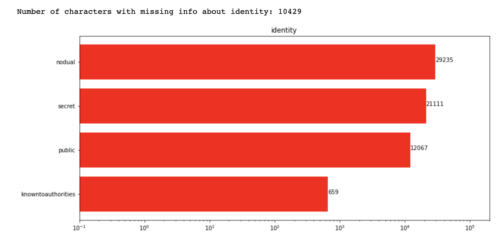
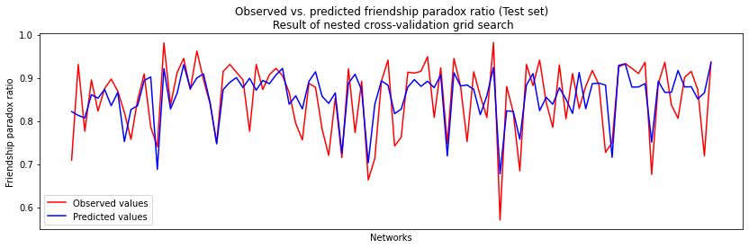
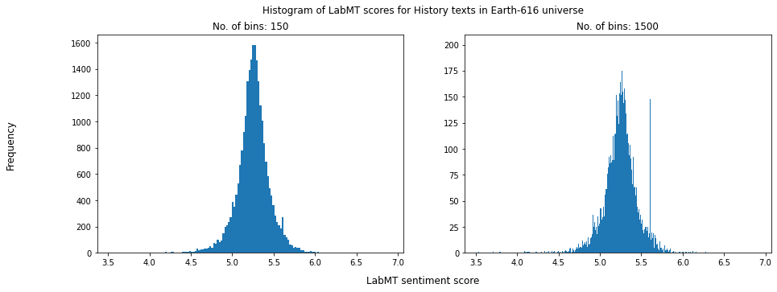

# Welcome to GitHub Pages for our Marvel Universe Project

## Motivation

## Basic statistics

## Toosl, theory and analysis

### Creating entire network of all characters

### Degree distribution of the entire network

### Character attribute analysis





### Network theory comparison

### Friendship paradox for Marvel characters





### Sentiment analysis




## Discussion


You can use the [editor on GitHub](https://github.com/kito323/MarvelUniverses/edit/gh-pages/index.md) to maintain and preview the content for your website in Markdown files.

Whenever you commit to this repository, GitHub Pages will run [Jekyll](https://jekyllrb.com/) to rebuild the pages in your site, from the content in your Markdown files.

Here is interactive iris dataset visualised



And here is interactive NetworkX graph



TEST


And this is how i feel after this


Interactive Deepnote cell

```<iframe title="Embedded cell output" src="https://embed.deepnote.com/972a3b21-ed0b-49ad-94ce-ad59397a5d4f/b12d7987-1634-4196-926d-80b7c2d0b3c6/00011-92273088-0012-4d1d-9dc5-98629df1b38d?height=83" height="400" width="600"/>
```

### Markdown

Markdown is a lightweight and easy-to-use syntax for styling your writing. It includes conventions for

```markdown
Syntax highlighted code block

# Header 1
## Header 2
### Header 3

- Bulleted
- List

1. Numbered
2. List

**Bold** and _Italic_ and `Code` text

[Link](url) and 
```

For more details see [Basic writing and formatting syntax](https://docs.github.com/en/github/writing-on-github/getting-started-with-writing-and-formatting-on-github/basic-writing-and-formatting-syntax).

### Jekyll Themes

Your Pages site will use the layout and styles from the Jekyll theme you have selected in your [repository settings](https://github.com/kito323/MarvelUniverses/settings/pages). The name of this theme is saved in the Jekyll `_config.yml` configuration file.

### Support or Contact

Having trouble with Pages? Check out our [documentation](https://docs.github.com/categories/github-pages-basics/) or [contact support](https://support.github.com/contact) and we’ll help you sort it out.
